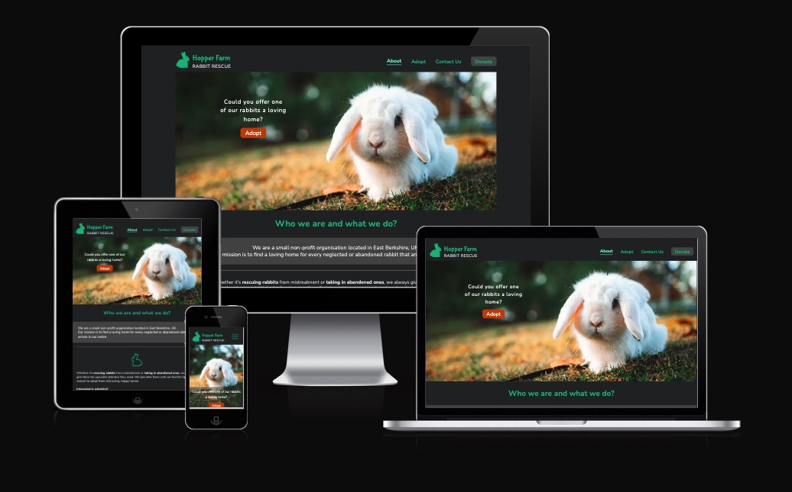
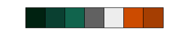
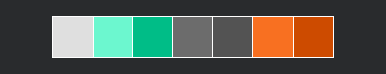

# Website for Hopper Farm Rabbit Rescue

This website was created as the 1st Milestone Project (User Centric Frontend Development Project) for Code Institute's web application development course.

----------

Live website: https://szilvia-csernus.github.io/rabbit_sanctuary

Hopper Farm Rabbit Rescue is a fictional non-profit organisation. The website is designed to support the charity's primary mission which is to help find new homes for rescued pet rabbits.

The website is fully responsive to any screen sizes as well as dark mode preferences.

---------

## CONTENTS

* [User Experience](#user-experience-ux)
  * [Webite Owner's Goals](#website-owners-goals)
  * [User Stories](#user-stories)

* [Design](#design)
  * [Colour Scheme](#colour-scheme)
  * [Typography](#typography)
  * [Imagery](#imagery)
  * [Wireframes](#wireframes)

* [Features](#features)
  * [General Features on Each Page](#general-features-on-each-page)
  * [Future Implementations](#future-implementations)
  * [Accessibility](#accessibility)

* [Technologies Used](#technologies-used)
  * [Languages Used](#languages-used)
  * [Frameworks, Libraries & Programs Used](#frameworks-libraries--programs-used)

* [Deployment & Local Development](#deployment--local-development)
  * [Deployment](#deployment)
  * [Local Development](#local-development)
    * [How to Fork](#how-to-fork)
    * [How to Clone](#how-to-clone)

* [Testing](#testing)

* [Credits](#credits)
  * [Icons](#icons)
  * [Main Images](#main-images)
  * [Gallery Images](#gallery-images)
  * [Other Credits](#other-credits---incorporated-ideas-and-solutions)
  * [Acknowledgments](#acknowledgments)

---

## User Experience (UX)

### Website Owner's Goals

* To help people find the organisation for the primary purpose of rehoming a rescued rabbit.
* To help find potential donors and volunteers willing to contribute to the charity's work.
* To help visitors to make contact with the organisation.
* The website to have simple structure and clear 'call to action' messages.
* The website to be responsive to all screen sizes as well as light/dark mode preferences.
---
### Website visitors' Goals

* To find the relevant piece of information quickly, be it about rabbit adoption, volunteering or donation.
* To be able to make contact with the charity for relevant requests effectively.
* To be able to find the location quickly.
* To be able to access the website in any screen sizes.
* To read the site comfortably when dark mode is preferrable.
---
## Design

All wireframes and design were created in [Figma](https://www.figma.com/).

### Colour Scheme

Colour choice was made in line with industry norms and customer expectations, green being the most frequent choice for for animal charity organisations. Orange was chosen as an accent colour to emphasize 'call to action' messages. In addition, various shades of greys were added to complement the two main colours.

Primary and accent colours were sampled from the hero image of the landing page, then slightly modified to satisfy accessibility requirements.

### Typography

Typography choice was made with the help of a font pairing website [Typ.io](https://typ.io/lists).
[Nunito](https://fonts.google.com/specimen/Nunito) and [Nunito Sans](https://fonts.google.com/specimen/Nunito+Sans) were selected from the [Google Fonts](https://fonts.google.com/) library for their simplicity, legibility yet fairly informal feel. 

### Imagery

Free images were chosen from [Pexels](https://pexels.com/) and [Unsplash](https://unsplash.com/) websites.
Feature rabbit icon was custom created by the author of the site, other icons were downloaded from [svgrepo](https://svgrepo.com/) and edited in [Figma](https://www.figma.com/).

### Wireframes - Low & High Fidelity Designs

All design was created by the author of the site with [Figma](https://www.figma.com/).

## Features

👩🏻‍💻 View an example of a completed user experience section [here](https://github.com/kera-cudmore/TheQuizArms#Features)

This section can be used to explain what pages your site is made up of.

### General features on each page

Header on large screens:

Header on small screens:

Side bars opening from burger menu:

Footer:

Volunteer form:

Donate form:

Thank you modal:

Favicons in light and dark mode:

Home page:

I then like to add a screenshot of each page of the site here, i use [amiresponsive](https://ui.dev/amiresponsive) which allows me to grab an image of the site as it would be displayed on mobile, tablet and desktop, this helps to show the responsiveness of the site.

### Future Implementations

What features would you like to implement in the future on your site? Would you like to add more pages, or create login functionality? Add these plans here.

## Accessibility

* All colours were tested to have sufficient contrast.
* All relevant elements that have implied meanings are labelled with aria-labels to be accessible for screen readers. 

* Fonts were chosen to be simple with clean contours to maximize legibility. 

* For font-sizes, 'rem' were used throughout the site instead of 'px' to allow the text to scale according to the users' preferred default font-size.

All colors were tested for contrast with the help of [Color Palette Contrast Checker](https://color-contrast-checker.deque.com/)

All pages on all screen sizes in both light and dark mode passed Lighthouse's accessibility test with 100%.

## Technologies Used

### Languages Used

The site was mainly built with HTML and CSS, although few lines of code in JavaScript was also added to customise Bootstrap's behaviour.

### Frameworks, Libraries & Programs Used

* [Figma](https://www.figma.com/) - to create design.

* [Git](https://git-scm.com/) & [Github](https://github.com/) for version control, safe storage and deployment.

* [Bootstrap Version 5.2](https://getbootstrap.com/docs/5.2/getting-started/introduction/) - for main frames, code for navigation bar, modals, forms and form validation.

* [Google Fonts](https://fonts.google.com/) - to import fonts into the stylesheet.

* [Google Dev Tools](https://developer.chrome.com/docs/devtools/) - for testing and troubleshooting.

* [CloudConvert](https://cloudconvert.com/jpg-converter) - to convert images to .webp format.

* [RealFaviconGenerator](https://realfavicongenerator.net/svg-favicon/) - to generate dark mode responsive favicons.

* [amiresponsive](https://ui.dev/amiresponsive) - to create site visuals for responsive design.

## Deployment & Local Development

👩🏻‍💻 View an example of a completed Deployment & Local Development section [here](https://github.com/kera-cudmore/TheQuizArms#Deployment)

### Deployment

Include instructions here on how to deploy your project. For your first project you will most likely be using GitHub Pages.

### Local Development

The local development section gives instructions on how someone else could make a copy of your project to play with on their local machine. This section will get more complex in the later projects, and can be a great reference to yourself if you forget how to do this.

#### How to Fork

Place instructions on how to fork your project here.

#### How to Clone

Place instructions on how to clone your project here.

## Testing

Start as you mean to go on - and get used to writing a TESTING.md file from the very first project!

Testing requirements aren't massive for your first project, however if you start using a TESTING.md file from your first project you will thank yourself later when completing your later projects, which will contain much more information.
  
Use this part of the README to link to your TESTING.md file - you can view the example TESTING.md file [here](milestone1-testing.md)

## Credits

### Icons
All icons have been edited.

Original Icons:

Visitors icon: https://www.svgrepo.com/svg/18735/class-open-door (No Copyright)

Gift icon: https://www.svgrepo.com/svg/61094/gift (No Copyright)

Helping hands icon: https://www.svgrepo.com/svg/76123/voluntary-service (No Copyright)

Facebook icon: https://www.svgrepo.com/svg/176882/facebook-social-media (No Copyright)

Instagram icon: https://www.svgrepo.com/svg/445823/instagram (Open Soruce MIT licence)

Twitter icon: https://www.svgrepo.com/svg/389481/twitter (Open Soruce MIT licence)

Location icon: https://www.svgrepo.com/svg/309741/location (Open Soruce MIT licence)

Phone icon: https://www.svgrepo.com/svg/425344/phone-1 (No Copyright)

Mail icon: https://www.svgrepo.com/svg/263869/email-mail (No Copyright)

### Main images

[Hero image](https://www.pexels.com/photo/close-up-view-of-white-rabbit-10595503/): Photo by Ali Atakan Açıkbaş on [Pexels](https://pexels.com/)

Adopting page image: Photo by [Lorna Ladril](https://unsplash.com/@lorna_ladril?utm_source=unsplash&utm_medium=referral&utm_content=creditCopyText) on [Unsplash](https://unsplash.com/s/photos/rabbits?utm_source=unsplash&utm_medium=referral&utm_content=creditCopyText) 

### Gallery images

["Fluff & Bunbun photo](https://www.pexels.com/photo/white-and-brown-rabbits-on-bed-6846043/) by Tima Miroshnichenko on [Pexels](https://pexels.com/)

["Jack & Jill" photo](https://www.pexels.com/photo/close-up-photo-of-rabbits-playing-11702024/) by Şeyma Dalar on [Pexels](https://pexels.com/) 

"Fish & Chips" photo by [Pure Julia](https://unsplash.com/@purejulia?utm_source=unsplash&utm_medium=referral&utm_content=creditCopyText) on [Unsplash](https://unsplash.com/s/photos/rabbits?utm_source=unsplash&utm_medium=referral&utm_content=creditCopyText)
  
"Miffy & Olive" photo by [Andriyko Podilnyk](https://unsplash.com/@andriyko?utm_source=unsplash&utm_medium=referral&utm_content=creditCopyText) on [Unsplash](https://unsplash.com/s/photos/rabbits?utm_source=unsplash&utm_medium=referral&utm_content=creditCopyText)
  
"Holly" photo by [Janan Lagerwall](https://unsplash.com/@stuffinabox?utm_source=unsplash&utm_medium=referral&utm_content=creditCopyText) on [Unsplash](https://unsplash.com/s/photos/rabbits?utm_source=unsplash&utm_medium=referral&utm_content=creditCopyText)
  
"Teddy" photo by [Satyabratasm](https://unsplash.com/@smpicturez?utm_source=unsplash&utm_medium=referral&utm_content=creditCopyText) on [Unsplash](https://unsplash.com/s/photos/rabbits?utm_source=unsplash&utm_medium=referral&utm_content=creditCopyText)
  
"Lola" photo by [Matt Pike](https://unsplash.com/@mjp_tw?utm_source=unsplash&utm_medium=referral&utm_content=creditCopyText) on [Unsplash](https://unsplash.com/s/photos/rabbits?utm_source=unsplash&utm_medium=referral&utm_content=creditCopyText)

"Cinnabun" photo by [Daniel McCarthy @themccarthy](https://unsplash.com/@danielmccarthy?utm_source=unsplash&utm_medium=referral&utm_content=creditCopyText) on [Unsplash](https://unsplash.com/s/photos/rabbits?utm_source=unsplash&utm_medium=referral&utm_content=creditCopyText)

"Hopper" photo by [Sandy Millar](https://unsplash.com/@sandym10?utm_source=unsplash&utm_medium=referral&utm_content=creditCopyText) on [Unsplash](https://unsplash.com/s/photos/rabbits?utm_source=unsplash&utm_medium=referral&utm_content=creditCopyText)

"Chester" photo by [Misha Walker](https://unsplash.com/@misharose?utm_source=unsplash&utm_medium=referral&utm_content=creditCopyText) on [Unsplash](https://unsplash.com/s/photos/rabbits?utm_source=unsplash&utm_medium=referral&utm_content=creditCopyText)

"Thumper" photo by [Chan Swan](https://unsplash.com/ja/@moyathebunny?utm_source=unsplash&utm_medium=referral&utm_content=creditCopyText) on [Unsplash](https://unsplash.com/s/photos/rabbits?utm_source=unsplash&utm_medium=referral&utm_content=creditCopyText)
  
"Daisy" photo by [Gabriel Miklós](https://unsplash.com/@gebgramm?utm_source=unsplash&utm_medium=referral&utm_content=creditCopyText) on [Unsplash](https://unsplash.com/s/photos/rabbits?utm_source=unsplash&utm_medium=referral&utm_content=creditCopyText)

"Oreo" photo by [Li Yan](https://unsplash.com/@yanli247?utm_source=unsplash&utm_medium=referral&utm_content=creditCopyText) on [Unsplash](https://unsplash.com/s/photos/rabbits?utm_source=unsplash&utm_medium=referral&utm_content=creditCopyText)

"Oliver" photo by [Jacob Amson](https://unsplash.com/@jacobamson?utm_source=unsplash&utm_medium=referral&utm_content=creditCopyText) on [Unsplash](https://unsplash.com/s/photos/rabbits?utm_source=unsplash&utm_medium=referral&utm_content=creditCopyText)

"Snowball" photo by [Pablo Martinez](https://unsplash.com/@pablomp?utm_source=unsplash&utm_medium=referral&utm_content=creditCopyText) on [Unsplash](https://unsplash.com/s/photos/rabbits?utm_source=unsplash&utm_medium=referral&utm_content=creditCopyText)
  
["Bruno and Tom" photo](https://www.pexels.com/photo/gray-and-brown-bunnies-8891763/) by Мария on [Pexels](https://www.pexels.com) 

### Other credits - incorporated ideas and solutions

* making svg icons responsive: https://css-tricks.com/cascading-svg-fill-color/ by Chris Coyier https://css-tricks.com/author/chriscoyier/

* using images in HTML in different sizes to improve performance:
https://css-tricks.com/responsive-images-youre-just-changing-resolutions-use-srcset/
https://ausi.github.io/respimagelint/docs.html
https://medium.com/@woutervanderzee/responsive-images-with-srcset-and-sizes-fc434845e948

* adding backup image in .png format for older Safari users
https://stackoverflow.com/questions/58487035/how-to-add-webp-support-in-safari-browser

* improving accessibility: https://web.dev/how-to-review/

### Content

Content was all written by the author of the site, however, inspiration was drawn from the following sites:

[The Littlest Lives Rescue](https://thelittlestlivesrescue.org.uk)

[South Coast Rabbit Rescue](https://www.southcoastrabbitrescue.co.uk)

[Essex Guinie Pig, Rat and Rabbit Rescue](https://www.egprr.org)

  
###  Acknowledgments

If someone helped you out during your project, you can acknowledge them here! For example someone may have taken the time to help you on slack with a problem. Pop a little thank you here with a note of what they helped you with (I like to try and link back to their GitHub or Linked In account too). This is also a great place to thank your mentor and tutor support if you used them.

