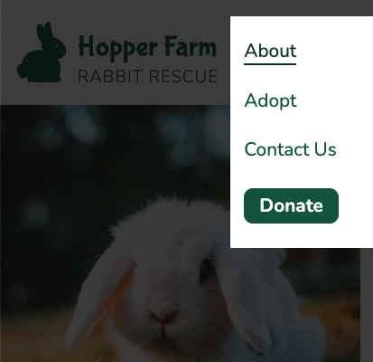
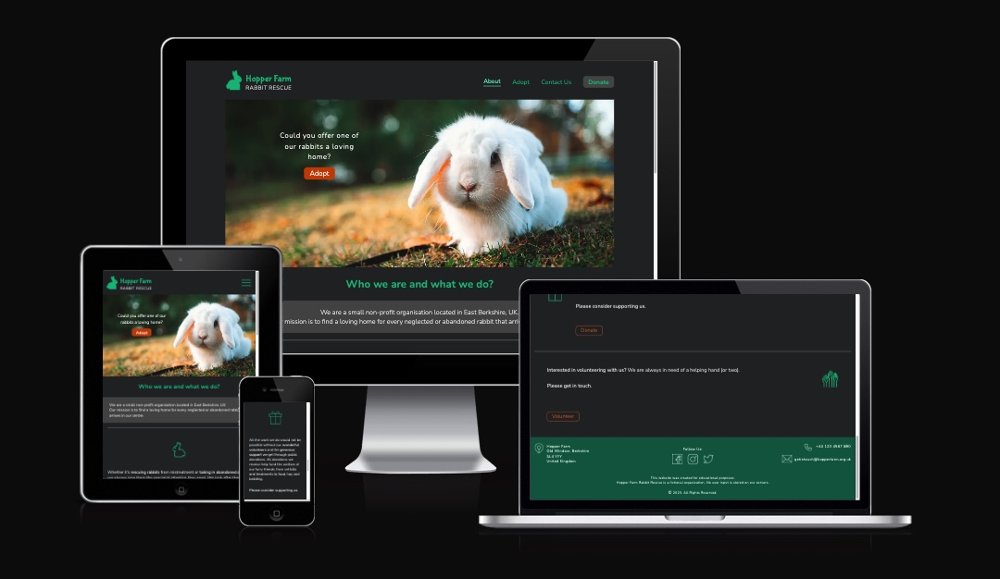
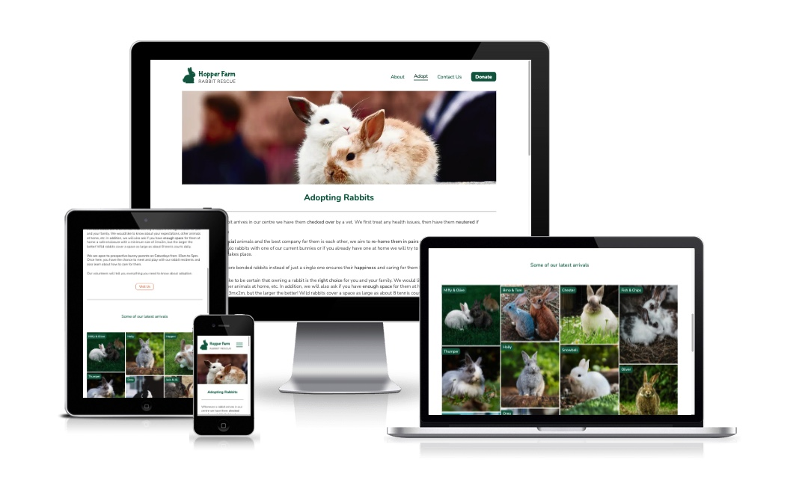

# Website for Hopper Farm Rabbit Rescue

This website was created as the 1st Milestone Project (User Centric Frontend Development Project) for Code Institute's web application development course.

---

### [View the live project here](https://szilvia-csernus.github.io/rabbit_sanctuary)

---

`Hopper Farm Rabbit Rescue` is a fictional non-profit organisation. The website is designed to support the charity's primary mission which is to help find new homes for rescued pet rabbits.
<br><br>


---

## CONTENTS

* [User Experience](#user-experience-ux)
  * [Webite Owner's Goals](#website-owners-goals)
  * [Website Visitors' Goals](#website-visitors-goals)

* [Design](#design)
  * [Colour Scheme](#colour-scheme)
  * [Typography](#typography)
  * [Imagery](#imagery)
  * [Wireframes](#wireframes)

* [Features](#features)
  * [General Features on Each Page](#general-features-on-each-page)
  * [Future Implementations](#future-implementations)
  * [Accessibility](#accessibility)

* [Technologies Used](#technologies-used)
  * [Languages Used](#languages-used)
  * [Frameworks, Libraries & Programs Used](#frameworks-libraries--programs-used)

* [Deployment & Local Development](#deployment--local-development)
  * [Deployment](#deployment)
  * [Local Development](#local-development)
    * [How to Fork](#how-to-fork)
    * [How to Clone](#how-to-clone)

* [Testing](#testing)

* [Credits](#credits)
  * [Icons](#icons)
  * [Main Images](#main-images)
  * [Gallery Images](#gallery-images)
  * [Other Credits](#other-credits---incorporated-ideas-and-solutions)
  * [Acknowledgments](#acknowledgments)

---

## User Experience (UX)

### Website Owner's Goals

* To help people find the organisation for the primary purpose of rehoming a rescued rabbit.
* To help find potential donors and volunteers willing to contribute to the charity's work.
* To help visitors to make contact with the organisation through various channels.
* The website to have simple structure and clear 'call to action' messages.
* The website to be responsive to all screen sizes as well as light/dark mode preferences.
---
### Website Visitors' Goals

* To find the relevant piece of information quickly, be it about rabbit adoption, volunteering or donation.
* To be able to make contact with the charity for relevant requests effectively.
* To be able to find the location quickly.
* To be able to access the website in any screen sizes.
* To read the site comfortably when dark mode is preferrable.
---
## Design

All wireframes and design were created in [Figma](https://www.figma.com/).

### Colour Scheme

Animal charities most frequently use green as their primary colour and I kept the site in line with this customer expectation. I chose orange as an accent colour to emphasize the 'call to action' messages. In addition, I used various shades of greys to complement the two main colours.

I sampled the primary and the accent colours from the hero image of the landing page, then I slightly modified them to satisfy accessibility requirements. 


### Typography

A font pairing website [Typ.io](https://typ.io/lists) helped me make typograpy choice.
I selected [Nunito](https://fonts.google.com/specimen/Nunito) and [Nunito Sans](https://fonts.google.com/specimen/Nunito+Sans) from the [Google Fonts](https://fonts.google.com/) library for their simplicity and legibility yet fairly informal feel. 

### Imagery

All the images appearing on the site are unlicenced, sourced from [Pexels](https://pexels.com/) and [Unsplash](https://unsplash.com/). All images have been converted to .webp format to reduce file size and as such, reduce loading time. To further increase performance, more image sizes are available for the browser to load the most appropriate one for any screen sizes. 

All icons are in .svg format that is lightweight in size, scales perfectly and certain properties can be set programatically. I needed these properties to make them capable to respond to dark-mode preferences. Some of the icons I drew myself in Figma, the others I downloaded from [svgrepo](https://svgrepo.com/). These latter icons are either unlicenced or open-source. All icons were drawn or edited to be uniform in design as well as responsive to dark mode or - as in the case of the rabbit icon - to screen size changes. All icons' colour is set programatically width css.

All references to the images and icons that have been sourced from other sites can be found in the [credits](#credits) section.

### Wireframes - Low & High Fidelity Designs

I created all designs in [Figma](https://www.figma.com/).


## Features

The website comprises of three pages: `Home/About` page, `Adopt` page and a `Contact Us` page. In addition, I added two overlay modals with forms for `volunteering` and `donation` as well as a `thank you` modal to appear after a successful form submission.

### General features on each page

The `header` is responsive to all screen sizes. On large screens, it expands horizontally, while on mobile and narrower screens the menu bar is replaced with a `burger` icon. Clicking this icon would make the menu appear as a side bar.

All types of the menu bar have Bootstrap codebase. I styled them in css to achieve the desired look. 

A hover effect gives the user feedback about the menu choices. The logo can be clicked from any pages to take the user back to the home page.

Dark mode is implemented throughout all pages to satisfy the website owner's UX requirement.


Header on small screens:


Side bars are opening from the burger menu icon:




The `footer` features all contact information as well as links to social media pages. Calls and Emails can be directly initiated by clicking on the links.


<h2 align="center" ></h2>

All modals and forms are Bootstrap features. I custom-styled them in css to look similar to the main design. 

The `Volunteer` and the `Donate form` pop-ups can be triggered from more pages. In the case when the `Donate form` is reached from the mobile sidebar, a custom script makes sure that the sidebar closes after clicking the `Donate button`. This script can be found in scripts.js.

Volunteer form:


Donate form:


The forms are validated by a script provided by Bootstrap. After passing all validations and submission of either of the forms, a `thank you modal` is triggered to appear. I achieved this behaviour by writing a short custom script in the scripts.js file.


Favicons are also responsive to light / dark mode preferences. They were generated with the help of [RealFaviconGenerator](https://realfavicongenerator.net/svg-favicon/).


`Home page` is the place where all important information and links can be found. Decorative icons help the user find the desired information effectively.




The `Adopt page` provides essential information about rabbit re-homing. Its aim is to encourage the user to make the next step in the adoption process and visit the centre. To support this goal, I included a rabbit gallery as well as `Visit Us buttons` to lead the user to the `Contact Us page`. 




On the `Contact Us page`, I included all the contact information the organisation can be reached from. Alongside the address, a live Google Maps frame helps with orientation.

The submission of a `Volunteer form` is another way of contacting the charity, so it features on this page as well.

Lastly, active links are provided for both calling and emailing the organisation.


### Future Implementations

* Further development could be a new page dedicated entirely to listing individual rabbits waiting for adoption. It would be implemented with a comprehensive database and backend server.

* The project could be transformed into a single-page application using ReactJS framework to bring the site in line with current industry standards.

## Accessibility

* To aid screen readers: 
  * `Semantic HTML` were used throughout all pages.

  * All images have descriptive `alt` attributes and all other elements that have implied meanings are labelled with `aria-labels` .

  * Current pages and modals are also labelled with the appropriate `aria properties` to help navigation.

* Fonts were chosen to be simple with clean contours to maximize legibility. 

* For font-sizes, `rem` were used throughout the site to allow the text to scale according to the users' preferred default font-size.

* All colours were tested beforehand to have sufficient contrast with the help of [Color Palette Contrast Checker](https://color-contrast-checker.deque.com/).


## Technologies Used

### Languages Used

The site was mainly built with [HTML5](https://en.wikipedia.org/wiki/HTML5) and [CSS3](https://en.wikipedia.org/wiki/CSS), although I added a few lines of code in [JavaScript](https://en.wikipedia.org/wiki/JavaScript) to customise some of Bootstrap's features.

### Frameworks, Libraries & Programs Used

* [Figma](https://www.figma.com/) 
  - to create the design.

* [Git](https://git-scm.com/) & [Github](https://github.com/) 
  - for version control, safe storage and deployment.

* [Gitpod](https://www.gitpod.io/) alongside with [CodeInstitute's template](https://github.com/Code-Institute-Org/gitpod-full-template) 
  - for the development environment.

* [Bootstrap Version 5.2](https://getbootstrap.com/docs/5.2/getting-started/introduction/) 
  - for main frames, code for navigation bar, modals, forms and form validation.

* [Google Fonts](https://fonts.google.com/) 
  - to import fonts into the stylesheet.

* [Google Map Generator](https://google-map-generator.com/) 
  - to generate Google Map iframe to address.

* [Google Dev Tools](https://developer.chrome.com/docs/devtools/) 
  - for testing and troubleshooting.

* [CloudConvert](https://cloudconvert.com/jpg-converter) 
  - to convert images to .webp format.

* [RealFaviconGenerator](https://realfavicongenerator.net/svg-favicon/) 
  - to generate dark mode responsive favicons.

* [Am I Responsive?](https://ui.dev/amiresponsive) 
  - to create site visuals for responsive design.

* [Gyazo](https://gyazo.com) 
  - for adding .gif file to this README


## Deployment

### GitHub Pages

The project was deployed to GitHub Pages using the following steps...

1. Log in to GitHub and locate the [GitHub Repository](https://github.com/)
2. At the top of the Repository (not top of page), locate the "Settings" Button on the menu.
3. Scroll down the Settings page until you locate the "Pages" Section.
4. Under "Source", click the dropdown called "None" and select "Main Branch".
5. The page will automatically refresh.
6. Once the deployment process completed the published site's link will appear after the main title.

### Forking the GitHub Repository

By forking the GitHub Repository we make a copy of the original repository on our GitHub account to view and/or make changes without affecting the original repository by using the following steps...

1. Log in to GitHub and locate the [GitHub Repository](https://github.com/)
2. At the top of the Repository (not top of page) just above the "Settings" Button on the menu, locate the "Fork" Button.
3. You should now have a copy of the original repository in your GitHub account.

### Making a Local Clone

1. Log in to GitHub and locate the [GitHub Repository](https://github.com/)
2. Under the repository name, click "Clone or download".
3. To clone the repository using HTTPS, under "Clone with HTTPS", copy the link.
4. Open Git Bash
5. Change the current working directory to the location where you want the cloned directory to be made.
6. Type `git clone`, and then paste the URL you copied in Step 3.

```
$ git clone https://github.com/YOUR-USERNAME/YOUR-REPOSITORY
```

7. Press Enter. Your local clone will be created.

```
$ git clone https://github.com/YOUR-USERNAME/YOUR-REPOSITORY
> Cloning into `CI-Clone`...
> remote: Counting objects: 10, done.
> remote: Compressing objects: 100% (8/8), done.
> remove: Total 10 (delta 1), reused 10 (delta 1)
> Unpacking objects: 100% (10/10), done.
```

## Testing

 Please view [TESTING.md](TESTING.md) for more information on testing.

## Credits

### Icons

All downloaded icons have been edited.

* Visitors icon: https://www.svgrepo.com/svg/18735/class-open-door (Unlicenced)

* Gift icon: https://www.svgrepo.com/svg/61094/gift (Unlicenced)

* Helping hands icon: https://www.svgrepo.com/svg/76123/voluntary-service (Unlicenced)

* Facebook icon: https://www.svgrepo.com/svg/176882/facebook-social-media (Unlicenced)

* Twitter icon: https://www.svgrepo.com/svg/389481/twitter (Open Soruce MIT licence)

* Location icon: https://www.svgrepo.com/svg/309741/location (Open Soruce MIT licence)

* Phone icon: https://www.svgrepo.com/svg/425344/phone-1 (Unlicenced)


### Main images

* [Hero image](https://www.pexels.com/photo/close-up-view-of-white-rabbit-10595503/): Photo by Ali Atakan Açıkbaş on [Pexels](https://pexels.com/)

* Adopting page image: Photo by [Lorna Ladril](https://unsplash.com/@lorna_ladril?utm_source=unsplash&utm_medium=referral&utm_content=creditCopyText) on [Unsplash](https://unsplash.com/s/photos/rabbits?utm_source=unsplash&utm_medium=referral&utm_content=creditCopyText) 

### Gallery images

* ["Fluff & Bunbun" photo](https://www.pexels.com/photo/white-and-brown-rabbits-on-bed-6846043/) by Tima Miroshnichenko on [Pexels](https://pexels.com/)

* ["Jack & Jill" photo](https://www.pexels.com/photo/close-up-photo-of-rabbits-playing-11702024/) by Şeyma Dalar on [Pexels](https://pexels.com/) 

* "Fish & Chips" photo by [Pure Julia](https://unsplash.com/@purejulia?utm_source=unsplash&utm_medium=referral&utm_content=creditCopyText) on [Unsplash](https://unsplash.com/s/photos/rabbits?utm_source=unsplash&utm_medium=referral&utm_content=creditCopyText)
  
* "Miffy & Olive" photo by [Andriyko Podilnyk](https://unsplash.com/@andriyko?utm_source=unsplash&utm_medium=referral&utm_content=creditCopyText) on [Unsplash](https://unsplash.com/s/photos/rabbits?utm_source=unsplash&utm_medium=referral&utm_content=creditCopyText)
  
* "Holly" photo by [Janan Lagerwall](https://unsplash.com/@stuffinabox?utm_source=unsplash&utm_medium=referral&utm_content=creditCopyText) on [Unsplash](https://unsplash.com/s/photos/rabbits?utm_source=unsplash&utm_medium=referral&utm_content=creditCopyText)
  
* "Teddy" photo by [Satyabratasm](https://unsplash.com/@smpicturez?utm_source=unsplash&utm_medium=referral&utm_content=creditCopyText) on [Unsplash](https://unsplash.com/s/photos/rabbits?utm_source=unsplash&utm_medium=referral&utm_content=creditCopyText)
  
* "Lola" photo by [Matt Pike](https://unsplash.com/@mjp_tw?utm_source=unsplash&utm_medium=referral&utm_content=creditCopyText) on [Unsplash](https://unsplash.com/s/photos/rabbits?utm_source=unsplash&utm_medium=referral&utm_content=creditCopyText)

* "Cinnabun" photo by [Daniel McCarthy @themccarthy](https://unsplash.com/@danielmccarthy?utm_source=unsplash&utm_medium=referral&utm_content=creditCopyText) on [Unsplash](https://unsplash.com/s/photos/rabbits?utm_source=unsplash&utm_medium=referral&utm_content=creditCopyText)

* "Hopper" photo by [Sandy Millar](https://unsplash.com/@sandym10?utm_source=unsplash&utm_medium=referral&utm_content=creditCopyText) on [Unsplash](https://unsplash.com/s/photos/rabbits?utm_source=unsplash&utm_medium=referral&utm_content=creditCopyText)

* "Chester" photo by [Misha Walker](https://unsplash.com/@misharose?utm_source=unsplash&utm_medium=referral&utm_content=creditCopyText) on [Unsplash](https://unsplash.com/s/photos/rabbits?utm_source=unsplash&utm_medium=referral&utm_content=creditCopyText)

* "Thumper" photo by [Chan Swan](https://unsplash.com/ja/@moyathebunny?utm_source=unsplash&utm_medium=referral&utm_content=creditCopyText) on [Unsplash](https://unsplash.com/s/photos/rabbits?utm_source=unsplash&utm_medium=referral&utm_content=creditCopyText)
  
* "Daisy" photo by [Gabriel Miklós](https://unsplash.com/@gebgramm?utm_source=unsplash&utm_medium=referral&utm_content=creditCopyText) on [Unsplash](https://unsplash.com/s/photos/rabbits?utm_source=unsplash&utm_medium=referral&utm_content=creditCopyText)

* "Oreo" photo by [Li Yan](https://unsplash.com/@yanli247?utm_source=unsplash&utm_medium=referral&utm_content=creditCopyText) on [Unsplash](https://unsplash.com/s/photos/rabbits?utm_source=unsplash&utm_medium=referral&utm_content=creditCopyText)

* "Oliver" photo by [Jacob Amson](https://unsplash.com/@jacobamson?utm_source=unsplash&utm_medium=referral&utm_content=creditCopyText) on [Unsplash](https://unsplash.com/s/photos/rabbits?utm_source=unsplash&utm_medium=referral&utm_content=creditCopyText)

* "Snowball" photo by [Pablo Martinez](https://unsplash.com/@pablomp?utm_source=unsplash&utm_medium=referral&utm_content=creditCopyText) on [Unsplash](https://unsplash.com/s/photos/rabbits?utm_source=unsplash&utm_medium=referral&utm_content=creditCopyText)
  
* ["Bruno and Tom" photo](https://www.pexels.com/photo/gray-and-brown-bunnies-8891763/) by Мария on [Pexels](https://www.pexels.com) 


### Other credits - incorporated ideas and solutions

* making svg icons responsive: https://css-tricks.com/cascading-svg-fill-color/ by Chris Coyier https://css-tricks.com/author/chriscoyier/

* making Google Maps iframe responsive to dark mode: https://codepen.io/kuranopen/pen/oNjMqGN

* using images in HTML in different sizes to improve performance:
https://css-tricks.com/responsive-images-youre-just-changing-resolutions-use-srcset/
https://ausi.github.io/respimagelint/docs.html
https://medium.com/@woutervanderzee/responsive-images-with-srcset-and-sizes-fc434845e948

* adding backup image in .png format for older Safari users
https://stackoverflow.com/questions/58487035/how-to-add-webp-support-in-safari-browser

* improving accessibility: https://web.dev/how-to-review/

### Content

* Content of the website was all written by the author, however, inspiration was drawn from the following sites:

  [The Littlest Lives Rescue](https://thelittlestlivesrescue.org.uk)

  [South Coast Rabbit Rescue](https://www.southcoastrabbitrescue.co.uk)

  [Essex Guinie Pig, Rat and Rabbit Rescue](https://www.egprr.org)

* Content for Deployment and Development of this README file was written using [Code Institute's sample README file](https://raw.githubusercontent.com/Code-Institute-Solutions/SampleREADME/master/README.md).
  
###  Acknowledgments

* My mentor [Elaine Broche](https://github.com/elainebroche-dev) for her helpful feedback she gave me throughout the development and testing process.

* Kera Cudmore for her advice on [how to write README files](https://github.com/kera-cudmore/readme-examples).

* My friends in the Slack Community for testing and continuous support.
