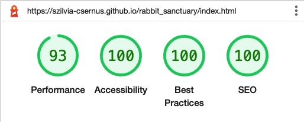
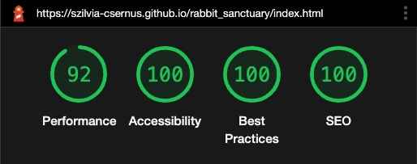
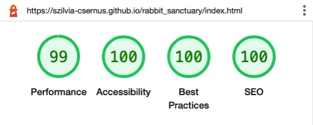
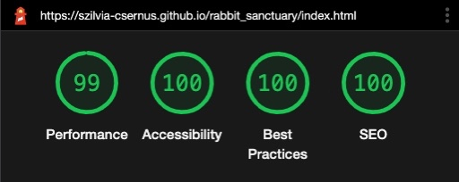
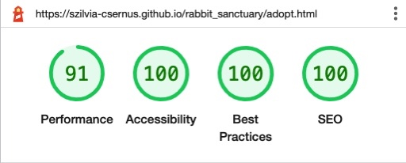
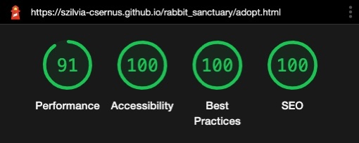
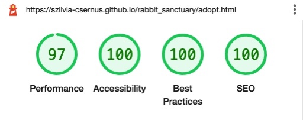
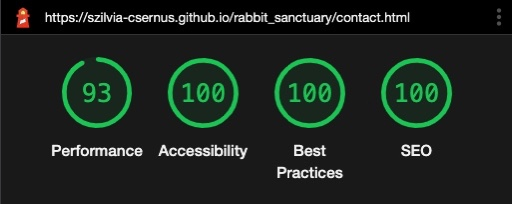
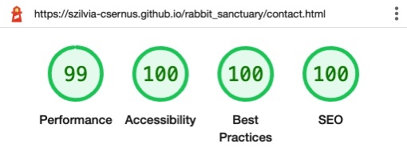
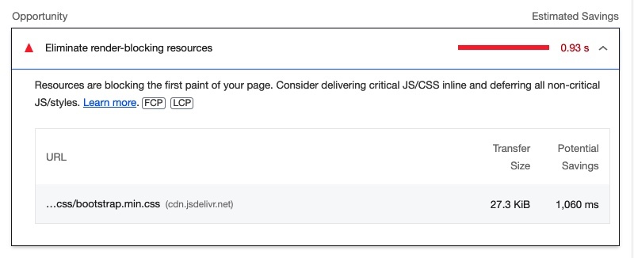

# Code validation

1. [Home page validation](assets/images/testing-images//home-validation.jpeg) - Passed, no error found.

2. [Adopt page validation](assets/images/testing-images//adopt-validation.jpeg) - Passed, no error found.

3. [Contact Us page validation](assets/images/testing-images//contact-validation.jpeg) - Passed, no error found.

4. [CSS validation](assets/images/testing-images//css-validation.pdf) - Passed, no error found.

5. [JS validation](assets/images/testing-images/js-validation.pdf) - Passed, no error found.

- - -
  

# Testing User Stories

## Website Owner's Goals

* To help people find the organisation for the primary purpose of rehoming a rescued rabbit.
    * The featured picture and message in the focus of the landing page make the site's main purpose instantly clear.
    * An entire page is dedicated for rabbit adoption, which can be reached from several links on all three pages.
    * The site's description in the `<head>` section makes the organisation's work clear for search engines.
* To help find potential donors and volunteers willing to contribute to the charity's work.
    * The `volunteering form` can be reached from both the `About Page` and the `Contact Us Page`.
    * `Donate` buttons feature in the menu bar on all pages. In addition, there is an additional link on the `About Page`.
* To help visitors to make contact with the organisation through various channels.
    * The channels include a `volunteer form`, a `telephone number`, an `email address`, a `physical address` as well as social media icons: `Facebook`, `Instagram`, `Twitter`.
    * There are several references to these channels throughout all three pages.
* The website to have simple structure and clear 'call to action' messages.
    * The website comprises of only three pages, all of which can be directly reached from the home page.
    * All 'call to action' messages are featured as a button, either in the menu bar or on the page in accent colour. They all convey unambigous messages to the user.
* The website to be responsive to all screen sizes as well as light/dark mode preferences.
    * Responsiveness testing was carried out with many browsers and screen sizes, please [see details below](#responsiveness-testing).
- - -
  

## Website Visitors' Goals

* To find the relevant piece of information quickly, be it about rabbit adoption, volunteering or donation.
    * The menu structure is simple and labelled according to the relevant content. 
    * All info can be reached with maximum one click, from either the menu, the home page or the footer section.
* To be able to make contact with the charity for relevant requests effectively.
    * All the links provided throughout the website are directly linked to the relevant channel. The `phone number` link allows to initiate a call directly, the `Email` link opens up the default email application, the `social media` links open the relevant sites in a new tab.
* To be able to find the location quickly.
    * The `address` features on all pages in the footer section.
    * On the `Contact Us` page, an embedded Google Maps `<iframe>` help with orientation.
* To be able to access the website in any screen sizes.
    * Responsiveness testing was carried out with many browsers and screen sizes, please [see details below](#responsiveness-testing).
* To read the site comfortably when dark mode is preferrable.
    * Dark mode is implemented throughout the website, this includes the changing of colours of all texts, buttons, icons, forms, modals as well as the embedded Google Maps `<iframe>`.
    * Dark mode automatically responds to the computer's set preference.

- - -
  

# Browser Tests

| Browser | Version | Page / Form | Expected Look | Expected Behaviour |
| :---: | :---: | :---: | :---: | :---: |
| Chrome | 108.0.5359.124 | About |&check; |  &check; |
|  |  | Adopt | &check; | &check; |
|  |  | Contact Us | &check; | &check; |
|  |  | Volunteer form | &check; | &check; |
|  |  | Donate form | &check; | &check; |
|  |  | Thank you modal | &check; | &check; |
| Chrome | 109.0.5414.83 | About |&check; |  &check; |
|  |  | Adopt | &check; | &check; |
|  |  | Contact Us | &check; | &check; |
|  |  | Volunteer form | &check; | &check; |
|  |  | Donate form | &check; | &check; |
|  |  | Thank you modal | &check; | &check; |
| Safari | 15.6.1 | About |&check; |  &check; |
|  |  | Adopt | &check; | &check; |
|  |  | Contact Us | &check; | &check; |
|  |  | Volunteer form | &check; | &check; |
|  |  | Donate form | &check; | &check; |
|  |  | Thank you modal | &check; | &check; |
| Safari | iOS 16.1.1 | About |&check; |  &check; |
|  |  | Adopt | &check; | &check; |
|  |  | Contact Us | &check; | &check; |
|  |  | Volunteer form | &check; | &check; |
|  |  | Donate form | &check; | &check; |
|  |  | Thank you modal | &check; | &check; |
| Firefox | 108.1 (24234) | About | &check; |  &check; |
|  |  | Adopt | &check; | &check; |
|  |  | Contact Us | &check; | &check; |
|  |  | Volunteer form | &check; | &check; |
|  |  | Donate form | &check; | &check; |
|  |  | Thank you modal | &check; | &check; |
| Edge | 108.0.1462.62 | About |&check; |  &check; |
|  |  | Adopt | &check; | &check; |
|  |  | Contact Us | &check; | &check; |
|  |  | Volunteer form | &check; | &check; |
|  |  | Donate form | &check; | &check; |
|  |  | Thank you modal | &check; | &check; |

- - -
  

# Responsiveness Testing

Responsiveness was tested using [Google Dev Tools](https://developer.chrome.com/docs/devtools/).
  

| Device | Page / Form | Expected Look | 
| :---: | :---: | :---: | 
| iPhone SE  | About |&check; |
|  | Adopt | &check; | 
|  | Contact Us | &check; |
|  | Volunteer form | &check; |
|  | Donate form | &check; |
|  | Thank you modal | &check; |
| iPhone XR | About |&check; |
|  | Adopt | &check; | 
|  | Contact Us | &check; |
|  | Volunteer form | &check; |
|  | Donate form | &check; |
|  | Thank you modal | &check; |
| iPhone 12 Pro | About |&check; |
|  | Adopt | &check; | 
|  | Contact Us | &check; |
|  | Volunteer form | &check; |
|  | Donate form | &check; |
|  | Thank you modal | &check; |
| Pixel 5 | About |&check; |
|  | Adopt | &check; | 
|  | Contact Us | &check; |
|  | Volunteer form | &check; |
|  | Donate form | &check; |
|  | Thank you modal | &check; |
| Samsung Galaxy S8+ | About |&check; |
|  | Adopt | &check; | 
|  | Contact Us | &check; |
|  | Volunteer form | &check; |
|  | Donate form | &check; |
|  | Thank you modal | &check; |
| Samsung Galaxy S20 Ultra | About |&check; |
|  | Adopt | &check; | 
|  | Contact Us | &check; |
|  | Volunteer form | &check; |
|  | Donate form | &check; |
|  | Thank you modal | &check; |
| iPad Air | About |&check; |
|  | Adopt | &check; | 
|  | Contact Us | &check; |
|  | Volunteer form | &check; |
|  | Donate form | &check; |
|  | Thank you modal | &check; |
| iPad Mini | About |&check; |
|  | Adopt | &check; | 
|  | Contact Us | &check; |
|  | Volunteer form | &check; |
|  | Donate form | &check; |
|  | Thank you modal | &check; |
| Surface Pro 7 | About |&check; |
|  | Adopt | &check; | 
|  | Contact Us | &check; |
|  | Volunteer form | &check; |
|  | Donate form | &check; |
|  | Thank you modal | &check; |
| Surface Duo | About |&check; |
|  | Adopt | &check; | 
|  | Contact Us | &check; |
|  | Volunteer form | &check; |
|  | Donate form | &check; |
|  | Thank you modal | &check; |
| Galaxy Fold | About | It's recommended to use the site with open device as screen is too narrow in closed position. |
|  | Adopt | It's recommended to use the site with open device as screen is too narrow in closed position. |
|  | Contact Us | It's recommended to use the site with open device as screen is too narrow in closed position. |
|  | Volunteer form | It's recommended to use the site with open device as screen is too narrow in closed position. |
|  | Donate form | It's recommended to use the site with open device as screen is too narrow in closed position. |
|  | Thank you modal | It's recommended to use the site with open device as screen is too narrow in closed position. |
| Samsung Galaxy A51/71 | About |&check; |
|  | Adopt | &check; | 
|  | Contact Us | &check; |
|  | Volunteer form | &check; |
|  | Donate form | &check; |
|  | Thank you modal | &check; |
| Nest Hub | About |&check; |
|  | Adopt | &check; | 
|  | Contact Us | &check; |
|  | Volunteer form | &check; |
|  | Donate form | &check; |
|  | Thank you modal | &check; |
| Nest Hub Max | About |&check; |
|  | Adopt | &check; | 
|  | Contact Us | &check; |
|  | Volunteer form | &check; |
|  | Donate form | &check; |
|  | Thank you modal | &check; |

- - -
  

# Accessibility tests

* Accessibility tests were carried out on a Chrome / MacOS browser-device combination:

    * Tabs are working as expected on all pages.
    * Screen reader works as expected on all pages, with one minor issue, detailed in the [Known Bugs](#known-bugs) section.
* Colour contrasts were checked using [a11y Contrast Checker](https://color.a11y.com/Contrast/). All pages passed the tests:
    * [About Page Contrast Check Result](assets/images/testing-images/a11y-contrast-about.pdf)
    * [Adopt Page Contrast Check Result](assets/images/testing-images/a11y-contrast-adopt.pdf)
    * [Contact Us Page Contrast Check Result](assets/images/testing-images/a11y-contrast-adopt.pdf)
* Further accessibility tests were done with Chrome Dev Tool's Lighthouse testing, [please see below](#lighthouse-tests).
- - -
  

# Lighthouse tests

Performance, Accessibility, Best Practices and SEO tests were carried out with [Google Dev Tools](https://developer.chrome.com/docs/devtools/)' **Lighthouse** tool in `Incognito` mode. Results are not 100% consistent, there is always a few percent variation at each performed test.

Results:

| Device | Page | Mode | Result | 
| :---: | :---: | :---: | :---: |
| Mobile | About | light mode | |
| Mobile | About | dark mode | |
| Desktop | About | light mode | |
| Desktop | About | dark mode | |
| Mobile | Adopt | light mode | |
| Mobile | Adopt | dark mode | |
| Desktop | Adopt | light mode | |
| Desktop | Adopt | dark mode | |
| Mobile | Contact Us | light mode | |
| Mobile | Contact Us | dark mode | |
| Desktop | Contact Us | light mode | |
| Desktop | Contact Us | dark mode | |

The lower performance scores were mainly caused by the way Bootstrap loads before the first render:

- - -
  

# Peer Review

In our dedicated Peer Code Review channel, five people reviewed my site and gave mainly positive feedback. I incorporated one suggestion regarding my rabbit gallery section. It was noted that the pictures are not clearly distinguishable from each other as there were no border or gaps between the pictures. I rectified this by adding small gaps around the pictures.

- - -
  

# Bugs

## Resolved Bugs

* The screen reader could not convey meaning from some of the icons. 
    * Solution: aria-labels were added to all these icons' tags.
* Current page was wrongly identified by the sceen reader.
    * Solution: aria-current was corrected.
* Google Map's `<iframe>` was not changing colour in dark mode.
    * Solution: Properly customising the google maps iframe in dark mode would require an API_KEY which can not be safely embedded into HTML files, so dark-mode colours are achieved by just filtering the maps' colours in css. The `hue-rotate`, `invert` and `contrast` properties were set to achieve darker colours.
* A friend of mine flagged the issue that main pictures on `About` and `Adopt` pages do not load in an older version (15.6.1 or earlier) of Safari. That was because I converted these images in `.webp` format to achieve significantly better performance score in Lighthouse. While `.webp` format is now widely accepted by all modern browsers, Safari was indeed the last one to implement this option from its version 16.0 in September 2022. Since this latest update is fairly recent, I decided not to ignore this issue but to add to all images an extra version in `.png` format as a backup. I elaborated on this solution in the [Imagery](./README.md#imagery) section of the [README.md](./README.md) file.

- - -
  

## Known Bugs

* When the screen reader is reading the `Adopt Page`'s main text, the reading stops before every highlighted text. I googled the issue, looked at local forums and asked advice on a specified slack channel, but found no solution. While this issue is an inconvenience, it does not block the availability of the content to the user.

